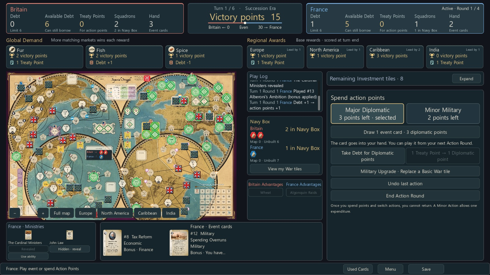

# Imperial Struggle / 제국의 투쟁

An unofficial Godot adaptation of GMT Games' Imperial Struggle, with English and Korean interfaces, solo play against basic or strategic AI, and local two-player hotseat play.

GMT Games의 보드게임 Imperial Struggle을 Godot로 구현한 비공식 프로젝트입니다. 영어·한국어 UI, 기본·전략 AI와의 혼자 하기, 한 컴퓨터에서 번갈아 하는 2인 플레이를 지원합니다.

[English](#english) · [한국어](#한국어) · [한국어 상세 실행 안내](README_KO.md) · [Validation / 검증](docs/VALIDATION.md)



## English

### What you can play

- Play Britain or France against basic or strategic AI, or share one computer in local hotseat mode with private handoff screens.
- Follow the full-game sequence of six Peace Turns and four wars, with automatic victory checks and final scoring.
- Use 41 Event cards, 26 Ministry cards, and 22 Advantages through the game's common rules and choice system.
- Compare your dealt hand while choosing Ministries. Keep Ministries hidden until you choose a rules-permitted reveal, including advance reveal during your own Action Round.
- Draw an Event card by spending 3 eligible Diplomatic points. Major and Minor action types use full names.
- Read both nations' Debt, Available Debt, Treaty Points, squadrons, hand sizes, Global Demand and regional rewards on a shared dashboard.
- See waiting squadrons as counters and numbers in both the central Navy Box panel and the printed Navy Box on the map. Counts update after construction, deployment and loading.
- Inspect cards above the Used Cards list, pan and zoom the original map, and save or resume pending card and war decisions.
- Switch between English and Korean from the title menu. The language preference persists across launches.

Strategic AI uses a shared 10/20/30-second search budget per Action Round in a separate rules-engine process. Actual hidden opponent cards and draw order are excluded. Save while thinking, pause from the menu, or choose Decide now.

### Run on Windows

The project was tested with Godot 4.7.2 on Windows at a 1600 × 900 window size. A standalone executable is not included.

1. Clone this repository, or download and extract its ZIP.
2. Open `godot_project/project.godot` in Godot and let the editor import the assets.
3. Press F5 to run the project's main scene.
4. Choose Britain, France, or local two-player play on the title screen. Use the language button to switch to English if needed.

You can also start it from PowerShell after setting your Godot path:

```powershell
$env:GODOT_EXE = 'C:\Tools\Godot\Godot.exe'
.\RUN.BAT
```

The launcher honors `GODOT_EXE`. Its fallback points to the development PC's Steam installation; set the variable on another computer or use the Godot editor. Godot itself and operating-system fonts are not bundled. The UI requests Malgun Gothic or Noto Sans KR/CJK KR for Korean text.

### Basic controls

| Control | Action |
|---|---|
| Click a map space | Perform an eligible action or choose an effect target |
| Hover over a space | Read its action cost and eligibility |
| Mouse wheel / zoom buttons | Zoom the map |
| Drag an empty map area | Pan the map |
| Click a hand card | Open its image and full effect; play it when eligible |
| Ministry reveal button | Choose whether to reveal during your own Action Round |
| Used Cards | Browse played Events; details appear above the list |
| Save / Load | Save the current state and resume it from the title screen |

Use Save before exiting. Returning to the menu is not an automatic save. The current UI uses one save slot at `%APPDATA%\Godot\app_userdata\Imperial Struggle\saves\autosave.json`, with a backup of the previous file. Despite the filename, the Save button updates this slot.

### Validation and current limits

The current validation snapshot includes 320 passing individual checks, 12 completed campaigns, and both English and Korean game-scene and visual/resume checks. See [the validation details](docs/VALIDATION.md) for what those checks establish and how to rerun them.

This is a playable learning project with basic and strategic AI. Automated comparisons against the original AI do not establish expert human strength. It does not include online multiplayer, a scenario/optional-rules settings screen, or an installer. Testing does not cover every combination of card effects or every operating system and resolution. Online play is planned for a later version.

## 한국어

### 플레이할 수 있는 기능

- 영국·프랑스로 기본·전략 AI와 대전하거나, 한 컴퓨터에서 비공개 교대 화면을 사용해 2인으로 플레이합니다.
- 평화 6턴과 전쟁 4개의 전체 게임 흐름, 자동 승리와 최종 득점을 연결했습니다.
- 이벤트 41개, 내각 26개, 이점 22개의 효과와 필요한 선택을 처리합니다.
- 내각 선택 중 이미 받은 손패를 비교하고, 자기 행동 라운드의 허용된 시점에 공개 여부를 선택합니다. 미리 공개도 가능합니다.
- 사용 가능한 외교 3점으로 이벤트 카드 1장을 뽑습니다. 주요 외교·보조 경제 등 행동 이름을 줄이지 않고 표시합니다.
- 채무·가용 채무·조약점수·함대·손패와 세계 수요·지역 보상을 한눈에 비교합니다. 상품과 보상에는 아이콘을 함께 표시합니다.
- 중앙 정보창과 지도 해군 상자에 대기 함대의 말과 숫자를 표시합니다. 건조·배치·불러오기 결과에 맞춰 함께 갱신합니다.
- 사용된 카드 목록 앞에 상세 보기를 열고, 지도를 확대·이동하며, 이벤트·전쟁의 선택 대기 상태도 저장하고 재개합니다.
- 제목 화면에서 영어·한국어를 전환하며, 선택한 언어는 다음 실행에도 유지됩니다.


### Windows에서 실행

Windows·Godot 4.7.2·1600 × 900 창에서 검증했습니다. 독립 실행형 EXE는 포함하지 않습니다.

1. 저장소를 복제하거나 ZIP을 내려받아 압축을 풉니다.
2. Godot에서 `godot_project/project.godot`를 열고 자료 불러오기가 끝날 때까지 기다립니다.
3. F5로 게임을 실행합니다.
4. 제목 화면에서 진영·플레이 방식을 고릅니다. 언어 버튼으로 한국어와 영어를 바꿀 수 있습니다.

Godot 경로를 지정하면 위 PowerShell 예시의 `RUN.BAT`로도 실행할 수 있습니다. 다른 PC에서는 `GODOT_EXE`를 지정하거나 Godot 편집기에서 실행하세요. 한글 표시에는 맑은 고딕 또는 Noto Sans KR/CJK KR 글꼴을 사용합니다.

종료 전 저장 버튼을 누르세요. 메뉴로 이동하는 것만으로 저장되지는 않습니다. 단일 저장 슬롯을 사용하며 직전 파일은 백업으로 보존합니다. 상세 조작과 저장 위치는 [한국어 실행 안내](README_KO.md)에 정리했습니다.

전략 AI는 라운드 전체의 10·20·30초 예산으로 행동 순서를 비교합니다. 상대 비공개 카드와 실제 뽑기 순서를 제외한 별도 게임에서 계산하며, 메뉴 중단·계산 중 저장·재개·지금 결정을 지원합니다.

### 검증과 현재 범위

개별 검사 320개, 캠페인 12판, 한국어·영어 UI 진행 및 실제 화면·저장 재개 검사를 통과했습니다. 모든 카드 조합과 모든 PC 환경을 전수 검증했다는 뜻은 아닙니다. [검증 기록](docs/VALIDATION.md)에서 세부 범위와 재실행 방법을 확인할 수 있습니다.

기본 AI와 전략 AI를 선택할 수 있습니다. 기존 AI와의 자동 대결이 숙련자 상대 실력을 증명하지는 않습니다. 온라인 대전, 시나리오·선택 규칙 설정, 설치형 배포본은 포함하지 않습니다. 온라인 대전은 후속 버전으로 계획하고 있습니다.

## Project guide / 프로젝트 문서

| Document / 문서 | Contents / 내용 |
|---|---|
| [README_KO.md](README_KO.md) | Detailed Korean play and launch guide / 자세한 조작·실행 안내 |
| [GUIDE_KO.md](GUIDE_KO.md) | Learning guide to the rules model, saves and UI / 플레이·개발 학습 |
| [RULES_IMPLEMENTATION.md](RULES_IMPLEMENTATION.md) | Official rules sources, implementation and limitations / 규칙 근거·구현·한계 |
| [PRD.md](PRD.md) | Product scope and roadmap / 제품 계획 |
| [docs/VALIDATION.md](docs/VALIDATION.md) | Reproducible validation snapshot / 검증 결과 |
| [docs/AI_IMPLEMENTATION.md](docs/AI_IMPLEMENTATION.md) | Strategic AI architecture and learning guide / 전략 AI 실행·구조·학습 |
| [NOTICE.md](NOTICE.md) | Original creators and third-party materials / 원작·자료 출처 |

The runnable project is in `godot_project/`. The repository also retains reference material from the earlier project. Generated Godot caches, temporary work, validation profiles, and game saves are excluded from version control.

실행 프로젝트는 `godot_project/`에 있으며 기존 작업의 참고 자료도 함께 보존합니다. Godot 생성 캐시·임시 작업·검사 상태·게임 저장 파일은 버전 관리에서 제외합니다.

## Credits / 원작

Original game: Ananda Gupta and Jason Matthews · GMT Games. This is an unofficial adaptation. Original artwork and third-party materials remain with their respective rights holders; see [NOTICE.md](NOTICE.md).

원작: Ananda Gupta · Jason Matthews / GMT Games. 이 프로젝트는 비공식 구현이며 원작 그림과 제3자 자료의 권리는 각각의 권리자에게 있습니다. 자세한 출처는 [NOTICE.md](NOTICE.md)를 참고하세요.
