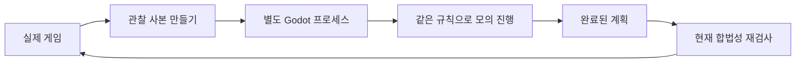

# 전략 AI: 실행과 학습 안내

2026-09-10. Windows · Godot 4.7.2 기준이다. 이 AI는 외부 언어 모델 서비스에 접속하지 않는다.

## 플레이

제목 화면에서 AI · 전략을 선택한 뒤 영국이나 프랑스로 혼자 하기를 시작한다. 기본 설정은 한 행동 라운드의 계산 예산 20초다. 10초·30초와 기존의 빠른 기본 AI도 선택할 수 있다. 계산 예산은 타일 하나, 카드 하나마다 다시 지급하지 않고 해당 라운드의 모든 재계산에 나누어 쓴다. 계산 뒤 행동을 화면에 적용하는 시간은 별도다.

계산 중에도 지도와 공개 정보를 볼 수 있고 저장할 수 있다. 지금 결정은 현재까지 찾은 완료된 계획으로 기다리기를 끝낸다. 아직 계획이 없다면 합법적인 빠른 선택을 사용한다. 메뉴로 돌아가면 작업 프로세스를 중단한다. 저장을 불러오면 현재 실제 판과 이미 사용한 계산 시간을 복원하고 새 작업을 시작한다. 종료한 프로세스 자체를 저장하는 방식은 아니다.

## 무엇을 비교하는가

기존 AI는 주로 행동점수가 많은 타일, 싸고 위신·수요 표시가 있는 공간을 골랐다. 전략 AI는 지금 그 공간을 바꾸었을 때 보상에서 어떤 차이가 생기는지 비교한다.

예를 들어 어느 상품의 시장 수가 2 대 2라면 시장 하나를 얻어 3 대 2가 되는 변화는 수요 보상을 가져온다. 이미 5 대 1인 상품을 6 대 1로 만드는 변화는 이번 수요 보상을 늘리지 않는다. 같은 시장이라도 평가가 달라지는 이유다. 지역 보상은 필요한 지배 공간 격차와 실제 배정된 승점·조약점수를 함께 사용한다.

평가에는 현재 승점, 지역·수요·위신 보상, 연결 거점, 가용 채무·조약점수·함대·손패, 내각의 득점 효과와 전쟁 보강 가치가 들어간다. 계수는 비교용 효용 단위이며 승률이나 공식 보상 수치 자체가 아니다. 전쟁의 미래 전력과 장기 연결 가치는 근사한다.

내각 선택은 가능한 두 장 조합과 자기 손패의 보너스 키워드를 함께 비교한다. 이미 드러난 내각의 교체 제한은 게임 규칙이 적용한다. 수동 능력·이벤트 혜택에 필요한 공개와 자기 라운드의 미리 공개를 명령으로 다루며, 공개하지 않고 유지할 선택권에도 작은 가치를 둔다. John Law, Sun King, East India Company 등 득점 단계에 필요한 효과는 공개할 시점을 앞당겨 검토한다. 선공 선택은 현재 기존의 자기 선공 선호를 유지한다.

## 왜 라운드 끝까지 시험하는가

한 번의 행동만 보면 채무를 늘리는 선택은 손해다. 하지만 그 점수로 결정적인 시장을 얻는다면 전체 계획은 이득일 수 있다. 검색은 타일·이벤트·내각·점수 출처·지도 행동·전쟁 준비를 이어서 실행하고 라운드 결과를 평가한다. 바로 상대가 한 라운드 응수하는 경우도 시험한다.

후보마다 여러 모의 진행 결과를 모은다. UCB는 현재 결과가 좋은 후보와 아직 적게 시험한 후보 사이에 계산 시간을 나누는 방법이다. 모의 진행은 평가가 높은 행동을 주로 선택하면서 일부 다른 순서도 시도한다. 시간이 끝나면 완료된 시도들의 평균으로 후보를 선택한다. 큰 행동 목록은 상위 후보로 줄이므로 모든 조합을 완전 탐색하는 방식은 아니다.

현재 구현은 UCB 기반 몬테카를로 롤아웃이다. 설계에서 참고한 ISMCTS 전체 알고리즘이나 학습으로 훈련한 신경망은 구현하지 않았다. 깊은 상대 수읽기, 대국 전체 탐색, 사람 수준의 심리전까지 해결했다는 뜻도 아니다.

## 실제 판과 계산 판

게임 규칙이 여러 Autoload에 나누어져 있기 때문에 얕은 복사본으로 같은 프로세스에서 시험하면 실제 카드나 점수가 바뀔 위험이 있다. 이번 구현은 규칙을 다시 작성하는 대신 프로젝트 자체를 별도 프로세스에서 실행한다. 계산 프로세스가 복원을 반복하더라도 사용자가 보는 게임의 전역 상태에는 접근하지 못한다. 실제 플레이에서는 항상 사람의 버튼과 같은 규칙 함수를 호출한다.

계산 결과에 쓰인 무작위 카드는 가정이다. 실제 카드 뽑기·전쟁 타일 뽑기·이벤트 등의 명령 이후에는 미리 계산한 후속 명령을 버리고 실제로 관찰한 결과에서 다시 판단한다. 상대가 선택할 차례도 대신 실행하지 않고 기다린다. 작업 ID, 현재 게임 모델, 진영과 합법 후보 검사를 통해 오래된 결과를 적용하지 않는다.

## 비공개 정보

- 자기 손패·내각·이미 본 자기 전쟁 타일은 알 수 있다.
- 상대 손패·미공개 내각·아직 공개되지 않은 전쟁 타일은 실제 신원을 넘기지 않는다.
- 상대의 공개된 카드와 타일, 손패·타일 수, 지도·자원·보상은 활용한다.
- 실행 취소 기록에는 과거 손패도 포함될 수 있으므로 관찰에서 제외한다.
- 이벤트와 투자 더미, 자기 타일 풀도 실제 다음 순서를 전달하지 않는다. 별도 난수로 섞는다.
- 실제 게임의 난수 상태를 복사하거나 소모하지 않는다. 계산 프로세스의 로그도 게임 기록 파일과 분리한다.

가정한 상대 정보는 구성표와 현재 공개 정보를 이용한 표본이다. 상대가 과거 비공개로 제거한 기본 전쟁 타일 등 모든 숨은 이력을 정확하게 추론하는 확률 모델은 아니다. 이는 공정성 제한과 별개인 판단 정확도의 한계다. 실제 신원을 바꿨을 때 같은 관찰을 만드는 검사와, AI가 강하게 플레이하는지는 서로 다른 검사다.

## 코드를 공부하는 순서

아래 경로는 `godot_project/scripts`를 기준으로 한다.

| 파일 | 읽을 내용 |
|---|---|
| `ai/baseline_ai.gd` | 비교 기준인 기존 고정 가중치 AI |
| `ai/evaluation.gd` | 보상 격차, 자원, 전쟁, 내각의 가치 |
| `ai/commands.gd` | 선택 가능한 명령 생성과 규칙 함수 연결 |
| `ai/observation.gd` | 사본 생성, 비공개 정보 제거와 표본 생성 |
| `ai/search.gd` | 후보 선택, 라운드 진행, 상대 응수와 시간 제한 |
| `ai/worker.gd` | 관찰 파일을 읽고 결과를 원자적으로 게시 |
| `autoload/ai_controller.gd` | 실제 게임의 프로세스·예산·중단·명령 실행 |
| `ai_regression.gd` | 비공개 정보·규칙 경계·즉시 승리·내각 공개 검사 |
| `ai_runtime_regression.gd` | 실제 작업 프로세스와 저장·재개 검사 |
| `ai_benchmark.gd` | 진영을 바꾼 기준 AI 대결 |

규칙 오류를 발견하면 평가 함수에서 보정하지 말고 실제 규칙 경로부터 고친다. 이번에 양쪽 선택 전 버림 카드 공개를 수정한 이유도 같다. 규칙 엔진이 잘못된 상태에서 계산을 깊게 하면 그 오류를 더 잘 이용하는 AI가 될 뿐이다.

검증 범위와 실측 대결은 [검증 기록](VALIDATION.md)을 참고한다. 모든 카드 조합의 완벽성이나 숙련자 상대 성능은 자동 검사만으로 증명하지 않는다.
