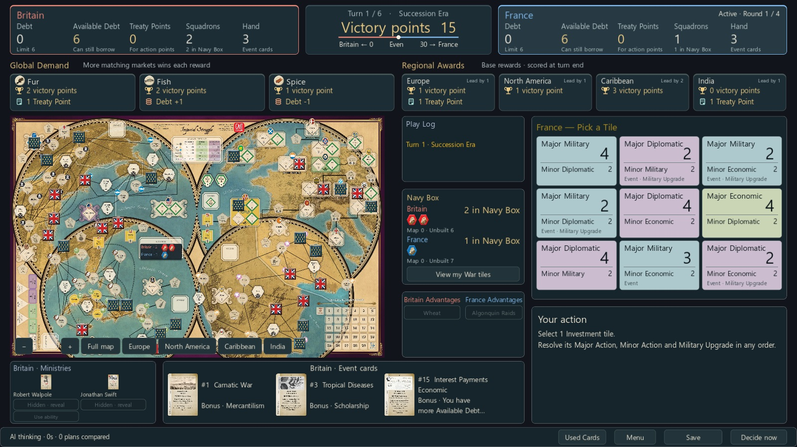

# Validation snapshot / 검증 기록

Checked on September 10, 2026, on Windows with Godot 4.7.2. These results describe the tested implementation; they are not a proof of every possible card interaction or AI strength.

2026년 9월 10일 Windows·Godot 4.7.2에서 확인했다. 아래 결과가 모든 카드 조합의 정확성이나 AI의 전략적 강도를 전수 증명하는 것은 아니다.

| Suite / 검사 | Result / 결과 |
|---|---|
| Rules / 규칙 | 53 passed |
| Cards / 카드 | 97 passed |
| Edge cases / 경계 조건 | 42 passed |
| Ministry reveal / 내각 공개 | 39 passed |
| Diplomatic event draw / 외교 카드 뽑기 | 33 passed |
| Localization / 언어 | 20 passed |
| Strategic AI: observations, legal commands and scoring / 전략 AI | 28 passed |
| Worker process, budget, cancel and resume / 계산 프로세스·중단·재개 | 8 passed |
| Total individual checks / 개별 검사 합계 | 320 passed |
| Full campaigns / 캠페인 | 12 completed; 6 reached Turn 6 |
| Live game scene with AI / 실제 게임 장면·AI | Korean and English passed |
| Rendered UI and resume / 실제 화면·저장 재개 | Korean and English passed |

Visual checks cover the hand shown during Ministry selection, optional Ministry reveal, the Used Cards detail overlay, event-card purchases with Diplomatic points, saved decisions, war choices, and the dashboard. The Navy Box checks use actual construction and deployment commands to confirm that the central panel and map show the same changing counts. Explicit display fixtures also cover zero and eight waiting squadrons, returning squadrons, four Global Demand commodities, and map zoom.

시각 검수는 내각 선택 중 손패 보기, 선택적 내각 공개, 사용된 카드 상세의 표시 순서, 외교 점수로 카드 뽑기, 저장된 선택 재개, 전쟁 선택과 대시보드를 포함한다. 해군 상자는 실제 건조·배치 명령으로 중앙 정보창과 지도의 수량 갱신을 확인했다. 0척·8척, 귀환 예정 함대, 세계 수요 4종과 지도 확대는 별도로 준비한 표시 상태에서도 확인했다.

Run the suites from PowerShell at the repository root:

```powershell
.\VERIFY.ps1 -GodotExe 'C:\Tools\Godot\Godot.exe'
```

The runner isolates each suite's user data and writes reports to `output/validation/`. Temporary profiles, reports, and game saves are excluded from Git. The selected README screenshots are stored in `docs/images/`.

검사마다 사용자 데이터 경로를 분리하고 `output/validation/`에 결과를 기록한다. 임시 검사 상태·보고서·실제 저장 파일은 Git에서 제외하며, README에 사용하는 화면만 `docs/images/`에 보관한다.


## Strategic AI validation / 전략 AI 검증

The strategic mode uses an independent Godot process and the same rule functions as the UI. Regression checks cover unchanged live state and RNG, hidden-card and hidden-tile identity invariance, unknown draw order, legal plans after JSON transfer, earlier-era cards in the Empire-era deck, immediate scoring wins, and advance Ministry reveal. The runtime check starts a real worker, verifies continuing UI frames, cancels it, saves the spent budget, reloads and completes a round.

전략 AI 검사는 실제 판·난수 불변, 숨은 상대 손패·내각·전쟁 타일 신원 변경, 숨은 순서, JSON 파일 왕복 명령, 제국 시대에 남은 이전 시대 카드, 즉시 승리하는 지역 보상과 미리 공개해야 하는 내각을 포함한다. 실제 프로세스 검사에서는 화면 갱신, 중단, 사용한 예산의 저장 복원과 라운드 완료를 확인한다.

The Korean and English rendered checks cover AI mode selection, Korean font glyphs, thinking status, Decide now, saving while thinking, menu pause and reload. Screens were inspected at 1600 × 900.

한국어·영어 실제 화면에서 모드 선택, 한글 글리프, 계산 표시·지금 결정·계산 중 저장·메뉴 중단·불러오기를 검수했다. 최종 메뉴에서는 복귀 버튼이 추가되어도 하단 출처와 겹치지 않도록 간격을 조정했다.



## Comparison method / 대결 방법

The benchmark uses the frozen original AI as its opponent and swaps the strategic side for each seed. Each process owns a test game. The benchmark restores only its own test state around simulations and reseeds actual test decisions separately from simulation randomness. It measures a finite-budget rollout policy, not expert human strength or a statistically established rating. Match search budgets exclude display animation; worker startup is tested separately by the runtime suite.

기존 AI를 기준으로 보존했고 같은 시작 seed에서 전략 AI의 진영을 바꾸어 비교한다. 대국 검사는 별도 테스트 게임만 사용한다. 모의 진행 후 해당 테스트 판을 복원하고 실제 대국 결정의 난수는 따로 설정한다. 화면 표시·프로세스 시작 시간은 대결 예산과 별도이며 실제 작업 프로세스 검사에서 따로 확인한다. 적은 표본의 승률을 숙련자 수준이나 확정된 실력 수치로 읽으면 안 된다.

| Final-code search budget / 최종 코드 계산 예산 | Seeds / 시작 seed | Games / 대국 | Strategic wins / 전략 AI 승리 |
|---|---|---:|---:|
| 1.5 s, accelerated comparison / 빠른 비교 | 71237, 89119; both sides | 4 | 3 |
| 20 s, deeper search / 깊은 계산 | 20260910; both sides | 2 | 2 |

All six matches completed without a stall; the strategic policy won five. The 1.5-second comparison and the 20-second comparison are different budgets and should not be treated as an established 20-second win rate. The sample is small. The two deeper matches ended on Turn 3 and simulated 4,376 and 5,738 actions, respectively. [Machine-readable results and source hashes](ai-results.json).

최종 코드의 6판 모두 정지 없이 끝났고 전략 AI가 5판 이겼다. 1.5초 빠른 비교와 20초 대결은 예산이 다르므로 이를 20초 모드의 확정 승률로 합치면 안 된다. 표본도 작다. 20초 대결 두 판은 모두 3턴에 끝났으며 각각 4,376개와 5,738개의 모의 행동을 실행했다. 설계에서 제안한 200판이나 숙련자와의 대결은 아직 수행하지 않았다.

To reproduce a benchmark, isolate APPDATA first, then run the ai_benchmark scene with user arguments `--budget-ms 20000 --seed 20260910`. The test game is intentionally separate from user saves. Exact timing and random policy samples can vary with machine load.

재현할 때는 APPDATA를 별도 검사 폴더로 지정하고 `ai_benchmark.tscn` 장면에 사용자 인자 `--budget-ms 20000 --seed 20260910`을 전달한다. 실제 저장과 분리해야 한다. 시간 제한 탐색의 표본 수와 선택은 PC 부하에 따라 달라질 수 있다.
